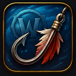

# Fishing-OneKey

Minimal-Addon für World of Warcraft (Midnight, Interface 120007): Angeln werfen und Fang einholen auf einer einzigen Taste – ganz ohne die vielen Zusatzfunktionen größerer Fishing-Addons wie Angleur.

 

## Funktionsweise

1. Du weist die gewünschte Taste per Chat-Befehl zu: `/fok bind`, dann die gewünschte Taste drücken (ESC bricht ab). Die Zuordnung wird gespeichert und übersteht Reload/Login.
   (Blizzards klassischer `Bindings.xml`-Mechanismus für AddOn-Tastenbelegungen wird von aktuellen Clients nicht mehr unterstützt – `<Binding>` wird als unbekanntes XML-Element abgelehnt. Deshalb der Weg über einen eigenen Chat-Befehl statt der Options-Tastenbelegungsliste.)
2. Drückst du die Taste außerhalb eines Angel-Channels, "klickt" sie einen unsichtbaren Secure-Button, der `Fishing` castet und die Angel auswirft – dieselbe Technik, mit der auch reguläre Aktionsleisten-Buttons Spells casten.
3. Sobald der Angel-Channel startet (`UNIT_SPELLCAST_CHANNEL_START`), legt das Addon dieselbe physische Taste per `SetOverrideBinding` auf die eingebaute Blizzard-Bindungsaktion `INTERACTTARGET` um – exakt die Aktion, die auch hinter der regulären Interaktionstaste aus den Spieloptionen steckt.
4. Endet der Channel (Fisch gefangen, abgebrochen oder Zeit abgelaufen), wird die Umlegung wieder entfernt. Die Taste wirft beim nächsten Druck erneut die Angel aus.

Es wird an keiner Stelle eine geschützte Funktion (`InteractUnit`) direkt aus unsicherem Code aufgerufen. Der Angel-Cast läuft über einen regulären `SecureActionButton` (wie ein Aktionsleisten-Button), das Umlegen während des Channels über `SetOverrideBinding` auf eine bereits vorhandene, von Blizzard bereitgestellte Bindungsaktion – beides offiziell dokumentierte, in vielen etablierten Addons genutzte Techniken.

## Installation

1. Ordner `fishing-onekey` nach `World of Warcraft/_retail_/Interface/AddOns/` kopieren.
2. Im Spiel `/fok bind` eingeben und die gewünschte Taste drücken.
3. Optional: **"Automatisches Beute nehmen"** (Optionen → Spiel/Interface → Beute) aktivieren, damit der Fang direkt ohne weiteren Klick ins Inventar wandert.

## Chat-Befehle

- `/fok bind` – nächste gedrückte Taste zuweisen (ESC bricht ab)
- `/fok unbind` – Zuordnung entfernen
- `/fok` – aktuell zugewiesene Taste anzeigen

## Einschränkungen

- Es wird keine eigene Bobber-Erkennung per Kamera-Scan durchgeführt (wie bei Angleur). Die Zuverlässigkeit hängt an Blizzards eigenem "Soft Interact"-System, das sichtfeldbasiert arbeitet – landet der Schwimmer außerhalb deines Sichtfelds, reagiert die Taste ggf. nicht.
- Kein Auto-Equip von Angelrute/-hut, keine Toys, kein Floß-Handling. Für alles darüber hinaus bleibt ein vollwertiges Fishing-Addon die bessere Wahl.

## Mitwirkende

Dieses Projekt wurde in Zusammenarbeit mit Claude (Sonnet 5) von Anthropic entwickelt und iterativ ausgebaut.
Der überwiegende Teil des Codes, der Architektur und der Dokumentation wurde durch KI generiert und gemeinsam verfeinert.

| Rolle | Person / Tool |
|---|---|
| Projektidee, Anforderungen & Tests | DasAoD |
| Code, Architektur, Dokumentation | Claude (Anthropic) |
